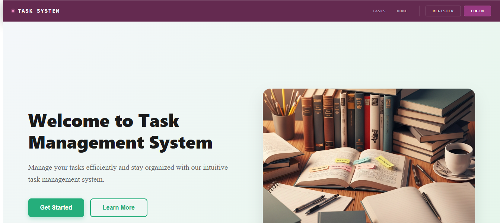
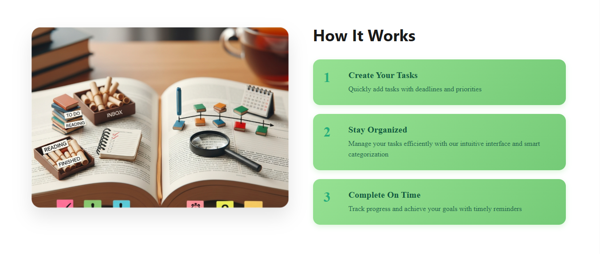
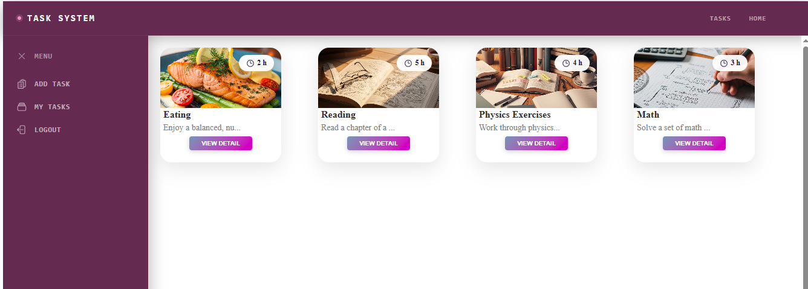
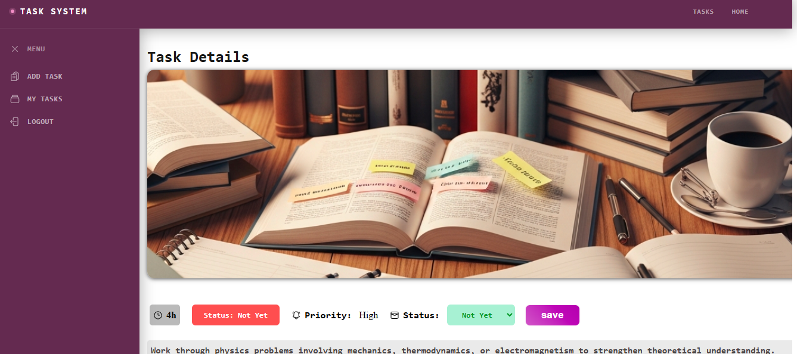
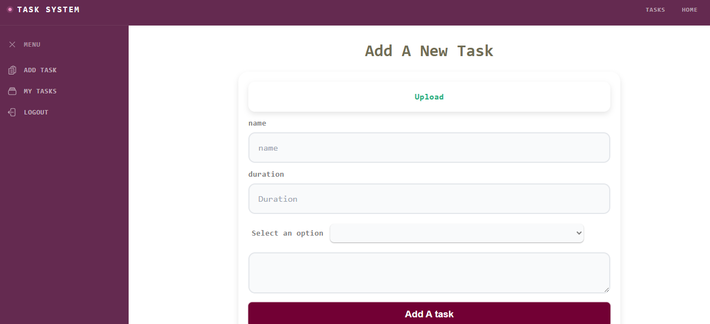
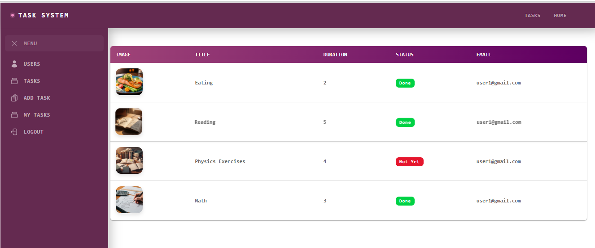

"# Task Management System

A comprehensive full-stack task management application built with **Spring Boot microservices** and **Angular** frontend. This system enables users to manage tasks efficiently with role-based access control and real-time updates.

## 📋 Table of Contents
- [Features](#features)
- [Project Architecture](#project-architecture)
- [Technology Stack](#technology-stack)
- [Project Structure](#project-structure)
- [Installation & Setup](#installation--setup)
- [Screenshots](#screenshots)
- [Running the Application](#running-the-application)

## ✨ Features

- **User Authentication & Authorization**: Secure login and signup with JWT tokens
- **Role-Based Access Control**: Different permissions for Admin and User roles
- **Task Management**: Create, read, update, and delete tasks
- **Task Filtering**: Filter tasks by status, priority, and assignment
- **User Management**: Admin panel to manage users
- **File Upload**: Custom image upload functionality
- **Responsive UI**: Mobile-friendly Angular interface
- **API Gateway**: Centralized routing for microservices
- **Real-time Communication**: Service-to-service integration

## 🏗️ Project Architecture

```
┌─────────────────────────────────────────────────────────┐
│                  Angular Frontend                       │
│              (Responsive UI Components)                 │
└──────────────────────┬──────────────────────────────────┘
                       │
                ┌──────▼──────────┐
                │  API Gateway    │
                │  (Port 8000)    │
                └──────┬──────────┘
                       │
        ┌──────────────┼──────────────┐
        │              │              │
   ┌────▼────┐  ┌─────▼────┐  ┌─────▼────┐
   │  Auth   │  │  Task    │  │  User    │
   │ Service │  │ Service  │  │ Service  │
   │(8001)   │  │ (8002)   │  │ (8003)   │
   └─────────┘  └──────────┘  └──────────┘
```

## 🛠️ Technology Stack

### Backend
- **Spring Boot**: Microservices framework
- **Spring Cloud**: API Gateway and service discovery
- **Spring Security**: Authentication and authorization
- **JWT**: Token-based authentication
- **Maven**: Build and dependency management

### Frontend
- **Angular 17+**: Modern web framework
- **TypeScript**: Type-safe development
- **RxJS**: Reactive programming
- **Angular CLI**: Build and development tools

### Architecture
- Microservices architecture
- API Gateway pattern
- JWT-based authentication
- RESTful APIs

## 📁 Project Structure

```
task-system/
├── backend/
│   ├── apigateway/          # API Gateway Service
│   ├── authservice/         # Authentication Service
│   └── taskService/         # Task Management Service
├── frontend/
│   └── src/
│       ├── app/
│       │   ├── components/  # Reusable UI components
│       │   ├── pages/       # Page components
│       │   ├── services/    # API services
│       │   ├── guards/      # Route guards
│       │   └── interceptors/# HTTP interceptors
│       └── assets/          # Static files
└── img/                     # Screenshots & images
```

## 🚀 Installation & Setup

### Prerequisites
- **Java 11+**: For Spring Boot backend
- **Node.js 18+**: For Angular frontend
- **Maven 3.6+**: For building backend
- **npm 9+**: For managing frontend dependencies

### Backend Setup

1. **Navigate to each service directory and build:**
   ```bash
   cd backend/apigateway
   mvn clean install
   
   cd ../authservice
   mvn clean install
   
   cd ../taskService
   mvn clean install
   ```

2. **Configure application properties** (if needed):
   - Edit `src/main/resources/application.properties` in each service

### Frontend Setup

1. **Install dependencies:**
   ```bash
   cd frontend
   npm install
   ```

2. **Configure API endpoints** (if needed):
   - Update service URLs in `src/app/services/`

## 📸 Screenshots

### Page 1 - Dashboard

Overview of the main dashboard and task management interface.

### Page 2 - Task List

Comprehensive task list with filtering and sorting capabilities.

### Page 3 - Task Details

Detailed view of a single task with all information and actions.

### Page 4 - User Management

Admin panel for managing users and their roles.

### Page 5 - Authentication

Secure authentication interface for login and registration.

### Page 6 - Profile & Settings

User profile management and settings page.

## ▶️ Running the Application

### Start Backend Services

1. **Start API Gateway** (Port 8000):
   ```bash
   cd backend/apigateway
   mvn spring-boot:run
   ```

2. **Start Auth Service** (Port 8001):
   ```bash
   cd backend/authservice
   mvn spring-boot:run
   ```

3. **Start Task Service** (Port 8002):
   ```bash
   cd backend/taskService
   mvn spring-boot:run
   ```

### Start Frontend

```bash
cd frontend
npm start
```

The application will be available at `http://localhost:4200`

## 📝 API Documentation

All requests should be made through the **API Gateway** at `http://localhost:8000`

### Key Endpoints
- **Authentication**: `/api/auth/login`, `/api/auth/signup`
- **Tasks**: `/api/tasks/create`, `/api/tasks/list`, `/api/tasks/update`
- **Users**: `/api/users/profile`, `/api/users/list`

## 🔐 Security Features

- JWT token-based authentication
- Role-based access control (RBAC)
- CORS configuration
- HTTP interceptors for automatic token injection
- Route guards for protected pages

## 📧 Support

For issues or questions, please refer to individual HELP.md files in each service directory." 
